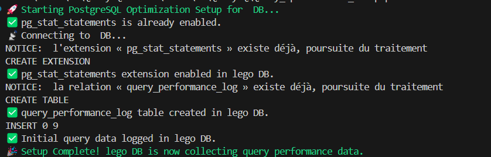
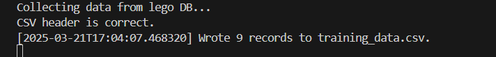
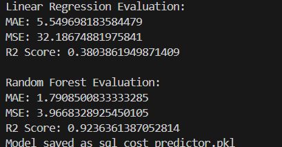

# QueryIQ

Intelligent SQL Query Optimization Engine

---

## Table of Contents
1. [Prerequisites](#prerequisites)
2. [Installation](#installation)
3. [Configuration](#configuration)
4. [Running the System](#running-the-system)


---

## Prerequisites

- Python 3.8 or higher
- PostgreSQL

**Screenshot Example:**


*Caption: Ensure all prerequisites are installed before proceeding.*

---

## Installation

Step-by-step instructions to install the system. Include commands and code snippets where necessary.

1. Clone the repository:
   ```bash
   git clone https://github.com/your-username/your-repo.git
2. Navigate to the project directory:

    ```bash
    cd your-repo
3. Install dependencies:
    ```bash
    pip install -r requirements.txt
Screenshot Example:Installation
Caption: Running the installation commands in the terminal.

## Configuration

Edit a ```config.json``` file, adding your password and username for the postgresql database:

    {
    "dbname": "Your_DB_Name",
    "user": "Your_DB_Owner_Name",  default: "postgres"
    "password": "Your_Password",
    "host": "localhost",
    "port": 5432
    }


## Running the System

1. Execute the PowerShell script to set up the query optimization environment:

  ```bash
  ./Query_optimization_setup.ps1
```



2. Run the ```data_collection.py``` script to collect the raw training data:

  ```bash
  python data_collection.py
```


3. Run the ```query_feature_extraction.py``` script for feature egineering:

  ```bash
  python query_feature_extraction.py
```


4. After  that you should have the training set ready for your model, so you can run ```model.training.py``` script for model training:

  ```bash
  python model_training.py
```



